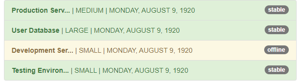
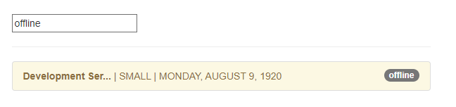
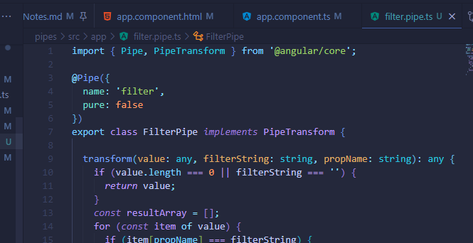

## Introduction and why pipes are useful

Purpose of a pipe it transforms some output. 

## Using Pipes

| <-- That. Those things are pipes

## Parametrizing Pipes

## Where to learn more about Pipes

<angular.io./docs/ts/latest/api/>

## Chaining Multiple Pipes

## Creating a Custom Pipe

2 BIG things on pipes

- You add this pipe decorator

- Make sure you've had the Transform method (interface)

- Adding Shorten Pipe ts
in declerations array in app module

## Parameterizing a Custom Pipe

Learned how to shorten information coming from the pipes. Customization

## Example: Creating a Filter Pipe

ng g p filter OR "ng generate pipe filter"

* delete the spec.ts (testing file). Just going to be working with filter.pipe.ts

NEAT! You can see all of the items, then filter through them via categories using the pipes

## Pure and Impure Pipes (or: How to "fix" the Filter Pipe)

Angular does not rerun the pipe when the data changes. So when you add a new server, it does not show when you are filtering pipes! Changing the input of the pipe will trigger a re-calculation.

Updating arrays or objects does NOT trigger it!

That's why you need pure in the filter.pipe.ts

Fine to update while filtering if that's what you're seeking, but MAY lead to performance issues. But it's possible!

## Understanding the "async" Pipe

