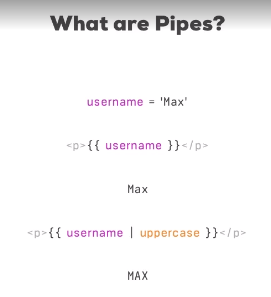
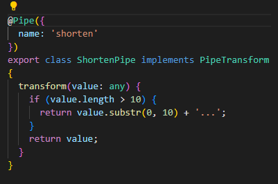

## Introduction and why pipes are useful

Purpose of a pipe it transforms some output. 

## Using Pipes

| <-- That. Those things are pipes

## Parametrizing Pipes

## Where to learn more about Pipes

<angular.io./docs/ts/latest/api/>

## Chaining Multiple Pipes

## Creating a Custom Pipe

2 BIG things on pipes

- You add this pipe decorator

- Make sure you've had the Transform method (interface)

- Adding Shorten Pipe ts
in declerations array in app module